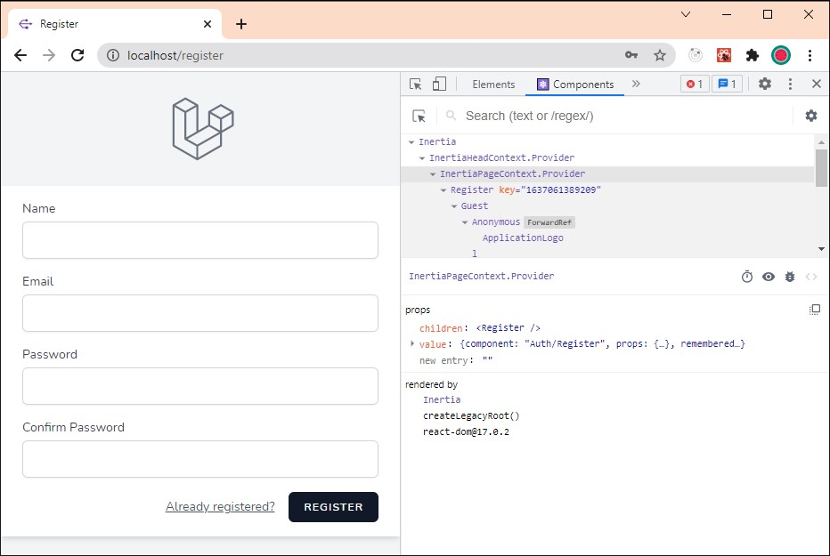
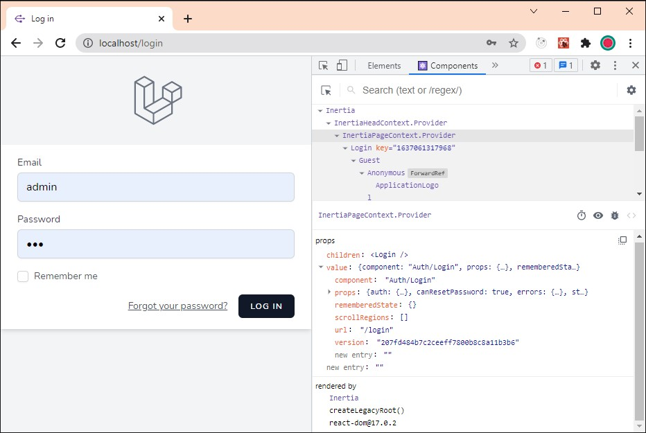
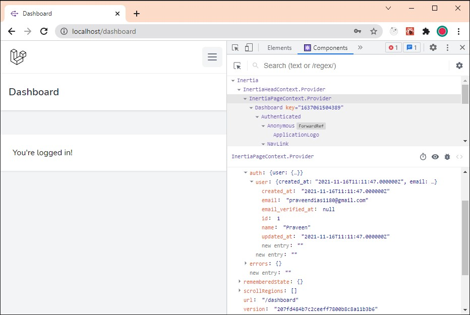
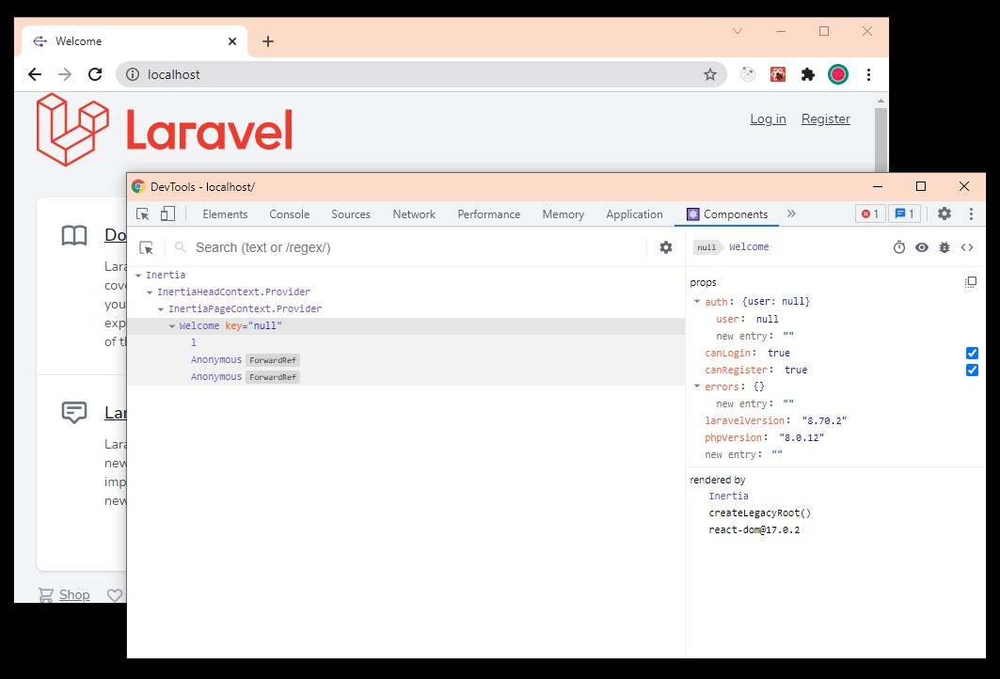
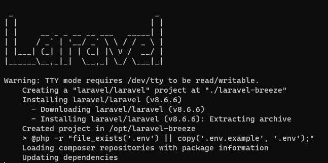
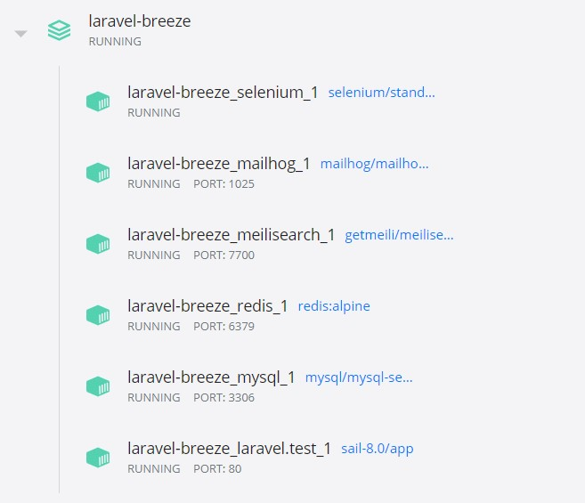

# Laravel Authentication

# Laravel React Registration

You get the React Registration page automatically when you create a Laravel Breeze app. It has all the validation logic built into it. You even get the registration email without any additional setup.



# Laravel React Login

The login screen lets you enter the application's internal pages. If you ever forget your password, you can reset it here.



# Breeze Dashboard

Once you successfully log in, you are taken to the dashboard. In the developer console, in the React component, you can see all the details about the currently logged in user.



# Larave + React

The front end is implemented with React. There is n option to install Vue as well. You just have to select it when you install Laravel Breeze.



# Installation


## Various Docker Containers used in the Application



# Laravel Breeze Commands

```
alias sail='[ -f sail ] && bash sail || bash vendor/bin/sail'
```

Now you can just use ```sail``

```
sail up
sail up -d
sail stop
```

# Installing React with Laravel Breeze

```
sail composer require laravel/breeze --dev
sail artisan breeze:install react
npm install
npm run dev
```
